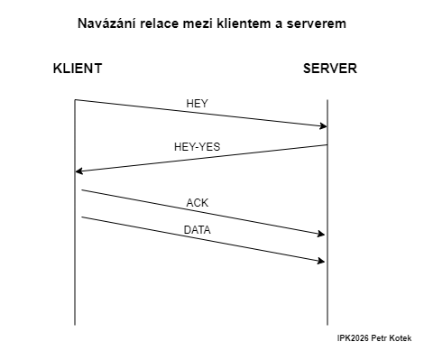
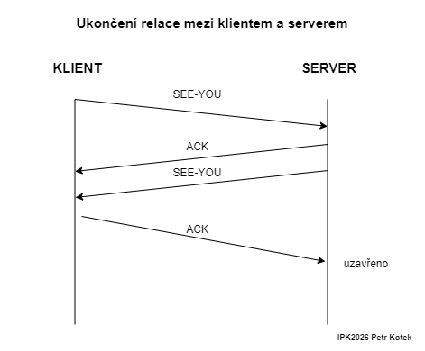
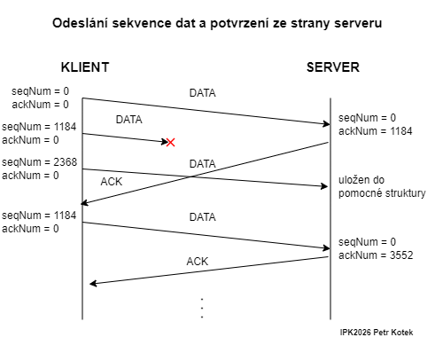
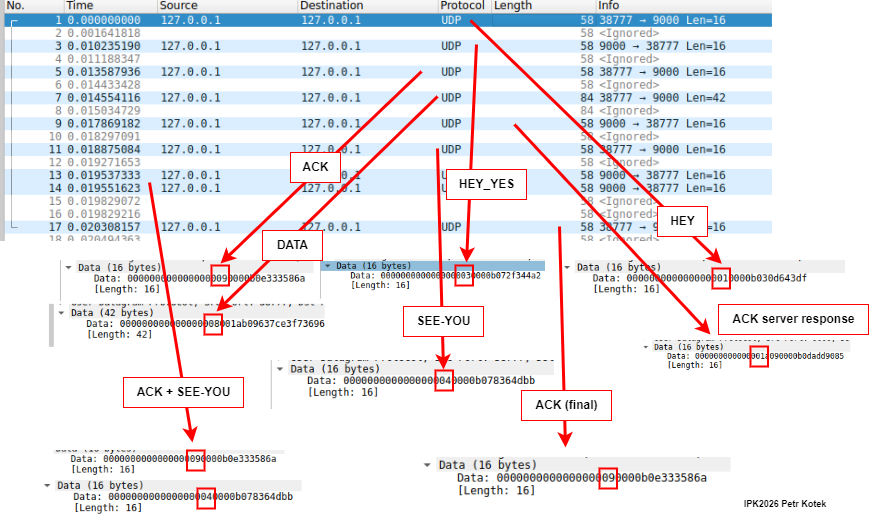

# Dokumentace druhého projektu do předmětu IPK - Spolehlivý přenos za pomocí UDP

UPOZORNĚNÍ (pro budoucí ročníky): Schvaluji použití projektu jako inspiraci, ovšem nesouhlasím s jeho kopírováním a využíváním jádra projektu pro svůj akademický prospěch.

## Struktura hlavičky paketu
```
    0                   1                   2                   3   
    0 1 2 3 4 5 6 7 8 9 0 1 2 3 4 5 6 7 8 9 0 1 2 3 4 5 6 7 8 9 0 1 
   +-+-+-+-+-+-+-+-+-+-+-+-+-+-+-+-+-+-+-+-+-+-+-+-+-+-+-+-+-+-+-+-+
   |                        Sequence Number                        |
   +-+-+-+-+-+-+-+-+-+-+-+-+-+-+-+-+-+-+-+-+-+-+-+-+-+-+-+-+-+-+-+-+
   |                    Acknowledgment Number                      |
   +-+-+-+-+-+-+-+-+-+-+-+-+-+-+-+-+-+-+-+-+-+-+-+-+-+-+-+-+-+-+-+-+
   |     Flags     |    Payload length       |    ConnectionID     |
   +-+-+-+-+-+-+-+-+-+-+-+-+-+-+-+-+-+-+-+-+-+-+-+-+-+-+-+-+-+-+-+-+
   |                              CRC                              |
   +-+-+-+-+-+-+-+-+-+-+-+-+-+-+-+-+-+-+-+-+-+-+-+-+-+-+-+-+-+-+-+-+
   |                             DATA                            ...
   +-+-+-+-+-+-+-+-+-+-+-+-+-+-+-+-+-+-+-+-+-+-+-+-+-+-+-+-+-+-+-+-+
   ```
Hlavička paketu se skládá ze:
- Pořadového čísla (**Sequence number**), které udává pozici prvního bajtu v daném paketu v rámci celkového datového toku
- ACK čísla (**Acknowledgment number**), které se rovná pořadovému číslu klienta plus počtu přijatých bajtů (v případě naplnění celého paketu je k tomuto číslu přičteno 1184).
- Flagů (**Flags**), kdy různé kombinace reprezentují různý význam. Paket může mít tyto flagy: `HEY, HEY_YES, SEE_YOU, DATA, ACK`.
- Pole obsahující délku dat (**Payload length**), pokud je paket naplněn zcela je v tomto poli reprezentováno číslo 1184, jinak je zde binárně zakódováno menší číslo.
- pole obsahující vygenerovaný identifikátor paketu (**ConnectionID**), jedná se o 8 bitovou reprezentaci náhodně vygenerovaného čísla.
- pole obsahující výpočet cyklického redundatního součtu (**CRC**). 
- pole dat (**DATA**), které obsahuje přenášená data

Celková délka hlavičky (bez dat) je 16 bajtů, pro přenos dat tedy zbývá 1184 bajtů.

## Navázání a ukončení relace
Tato sekce je rozdělena na dvě, první popisuje navázíní komunikace mezi klientem a serverem, zároveň popisuje případy možných zkrát paketu během cesty a jejich řešení. V druhé sekci je popsáno ukončení komunikace mezi klientem a serverem.
### Navázání komunikace mezi klientem a serverem
Navázání komunikace mezi klientem a serverem začíná zasláním paketu s nastaveným flagem `HEY` serveru. V případě, že server tuto zprávu neobdrží a neodpoví klientovi způsobem popsaným níže, zasílá klient opětovně paket na server s flagem `HEY`. Toto provede několikrát dokud mu to časový interval zadáný uživatelem dovoluje, avšak vždy s intervalem minimálně 300ms. Pokud ani tak server neodpoví, je pokus o spojení mezi server ukončen a program ukončen též. Zároveň je, před zasláním, vygenerován identifikátor spojení (ConnectionID), který je součástí odeslaného paketu, tato hodnota slouží pro ověření, že zaslaný paket patří do komunikace mezi klientem a serverem.

V případě obdržení paketu s flagem `HEY` na straně serveru dochází prvně je kontrole paketu, tedy ověření shodnosti u výpočtu CRC [[4]](#4). Dále také dochází k zapamatování identifikátoru spojení (ConnectionID), kdy tato hodnota je následně vždy ověřována. Následně ze strany serveru dochází k odeslání paketu s flagem `HEY-YES` zpět klientovy. Stejně jako v případě klienta, pokud server nedostane odpověď, odešle paket znovu, v případě vypršení časového intervalu ukončuje svou činnost.

Jakmile klient obdrží paket s flagem `HEY-YES` odesílá serveru paket s flagem `ACK` a následně pakety s daty. Tímto otestováno navázání spojení mezi klientem a serverem. Následně začíná přenos dat, který bude popsán v sekci popisující přenos dat.

<p align="center">
  
</p>

### Ukončení spojení mezi klientem a serverem
V případě, že klient odeslal veškerá svá data, tedy je ověřeno podmínkou, že počet odeslaných a zároveň úspěšně přijatých segmenetů dat je naplněn, ukončuje spojení se serverem. Ukončení začíná zaslání paketu s flagem `SEE-YOU`. Klient se následně přesouvá do stavu, kdy očekává od serveru odpověď. Pokud odpoveď nedorazí (paket byl například po cestě ztracen), dochází k znovu odeslání paketu s flagem `SEE-YOU`. Pokud ani tak klient neobdrží odpověď a dojde k vypršení časového limitu, je klient ukončen.

Server po obdržení paketu s flagem `SEE-YOU` odpovídá klientovy paketem `ACK`, za kterým následuje paket s flagem `SEE-YOU`. Opět, pokud klient tyto pakety neobdrží, pochází k jejich opětovnému odeslání, avšak opět do doby, než vyprší časový limit.

Jakmile klient obdrží následující dva pakety, zasílá serveru ještě paket s flagem `ACK` a ukončuje svou činnost.

<p align="center">
  
</p>

## Odesílání sekvence dat a potvrzování
Při úspěšném navázání spojení se serverem, dochází k odeslání jednotlivých segmentů dat. Před odesláním těchto dat je spočítána celková délka dat v bajtech a počet potřebných paketů za pomocí metody `ComputeNumberOfReqPackets`, tyto data jsou rozděleny do jednotlivých intervalů, kdy každý tento interval je uložen do pomocné struktury `PreparePacketStruct` v listu `packetDataInOrder` za pomocí metody `PrepareDataForEachPacket`. Následně je nastavena defaultní velikost okna pro odeslání paketů na velikost 4 (4 pakety), velikost okna se dále zvyšuje, toto chování je popsáno v sekci o chování okna. Dále jsou deklarovány proměnné `startPacketIdx`, reprezentující index prvního paketu v listu `packetDataInOrder`, který bude odeslán a `nextPacketIdxInOrder` reprezentující index paketu, který bude odeslán jako další, tato hodnota se postupně inkrementuje při odeslání dalšího paketu. Obě zmíněné proměnné jsou defaultně nastaveny na hodnotu 0.
### Odesílání sekvence dat
Po odeslání paketu s flagem `ACK`, tak jak bylo popsáno v sekci Navázání spojení, je vypočítán maximální počet paketů, který bude odeslán na jednou, tento počet reprezentuje proměnná `maxRangeIndex`. Následně jsou všechny pakety odeslány, jako první je vybrán z listu paketů za pomocí indexu `nextPacketIdxInOrder` paket a uložen do proměnné `pkt` (reprezentuje strukturu `PreparePacketStruct`), následně je volána metoda `PreparePacket`, která jako argumenty přijímá: flag, který chceme nastavit; sekvenční číslo paketu v proměnné `pkt`; ack číslo, zde je nula; a data, která jsou uložena ve struktuře `pkt`. Packet je následně odeslán a proměnná `nextPacketIdxInOrder` inkrementována. Toto je prováděno pokud nenaplníme velikost okna a počet odeslaných paketů je menší jak počet potřebných k odeslání.

### Potvrzování paketů
Pro ověřování aktuálního pořadového čísla (Sequence number), slouží pomocná proměnná `expectedSeq`. Jakmile paket dorazí na server, je uložen do pomocné proměnné `received`. Následně je volána pomocná metoda `AcceptSegment`, která zjistí, jestli se jedná o očekáváný segment nebo ne. V této metodě je paket zpracován, tzn. je zjištěna délka dat za pomocí metody `ReadDataLength`, zjištěno pořadové číslo za pomocí metody `ReadSeqNum` a extrahována samotná data. Zároveň je důležité zmínit, že existuje pomocná struktura `outOfOrder`, ve které jsou uloženy pakety, které dorazili před očekávaným paketem a měli **větší** pořadové číslo, než bylo očekáváno. Pokud je pořadové číslo paketu stejné jako očekávané pořadové číslo, je inkrementována hodnota očekávaného pořadového čísla o delku dat v paketu, data jsou následně uložena a pokud existují nějaké již před tím pakety, které dorazili a měli větší pořadové číslo než očekávané, tak je pomocná struktura `outOfOrder` prozkoumána a pokud v ní je paket, s očekávaným pořadovým číslem, tak je tento paket také uložen a pořadové číslo inkrementováno. Pokud dorazí paket s větší pořadovým číslem než je očekáváno, je tento paket uložen do struktury `outOfOrder`.

Server následně odesílá paket s flagem `ACK` a jako hodnotu ACK uvádí očekávaného dalšího pořadového čísla paketu.

<p align="center">
  
</p>

Na obrázku je demostrováno odeslání ACK paketu zpět klientovy, je zde také demonstrováno doražení paketu s větší hodnotou pořadového čísla, než je očekáváno kdy je tento paket zároveň zpracován, pokud dorazil jeho předchůdce a byl očekáván. Jedná se o ukázkový příklad logiky. Program ve skutečnosti opět odesílá na jednou více paketů, jelikož dochází ke zvětšení okna, zde však tento princip na obrázku není, bude popsáno v sekcích níže.

## Strategie znovuodesílání paketů a zpracování limitu času
Na každé straně (server i klient) je vytvořena proměnná `lastProgress`, která představuje čas poslední platné interakce s paketem (příjem očekávaného, odeslání dalšího, ...). Tato proměnná je během běhu programu aktualizována. Pokud čas zadaný uživatelem (nebo defaultně) vyprší, je program na dané straně, která nestihla ve sjednaný čas nic provést ukončen.

Na straně serveru dochází k aktualizaci časovače když: je server ve stavu, kdy jen naslouchá a čeká na úvodní paket, dojde k odeslání paketu `HEY-YES`, serveru příjde paket s daty a očekávaným pořadovým číslem a v případě kdy server odesílá paket na potvrzení ukončení spojení.

Na straně klienta dochází k aktualizaci časovače když: klient obdrží paket od server s potvrzením nabídky spojení, v případě přijetí validního paketu a odesílání dalších a v případě dokončování ukončování spojení mezi klientem a serverem.

### Strategie znovuodesílání paketů
Doba, po které je paket znovu odeslán v případě nepřijetí odpovědi od příjemce je nastavena na 300ms, tento údaj jsem určil během testování jako nejvhodnější vzhledem k testovacím případům, které jsem zkoušel. Lepším způsobem by byl vypočet za pomocí RTT, řešení tuto implementaci však z důvodu časové tísně nemá. Pro kontrolu tohoto intervalu je vytvořen nový `CancellationTokenSource`, který je propojen se stávajícím tokenem, který obsluhuje například náhlý pokyn pro ukončení programu ze strany uživatele. Časovač tohoto nově vytvořené tokenu je nastaven na hodnotu 300ms, program automaticky hlídá vypršení tohoto časovače, jakmile k tomuto vypršení dojde, je zachycena vyjímka, která následně rozhodne, co se bude dít. Pokud celkový interval ještě nevypršel, jsou prozkoumány stavy, ve kterých se buď klient, nebo server nachází. Například v případě ztráty paketů obsahující data, dochází k jejich znovuodeslání. Celá tato strategie znovuodeslání byla inspirována protokolem TCP. [[1]](#1)

Klient používá Go-Back-N. [[2]](#2) Tento přístup spočívá v tom, že při detekci ztráty paketu klient znovuodešle všechny pakety od ztraceného dál, ne pouze jediný ztracený paket. Při znovuodeslání po 5 duplicitních ACK klient nastaví ukazatel `nextPacketIdxInOrder` zpět na `startPacketIdx` (začátek okna) a odešle znovu celé aktuální okno. Toto se děje i v případě ztráty odpovědi pro příjemce (klienta), v tomto případě se odešle celé aktuální okno od nejstaršího nepotvrzeného paketu.

## Chování okna
Klient používá mechanismus sliding window s adaptivní velikostí. Velikost okna určuje, kolik datových paketů může být odesláno najednou bez čekání na potvrzení ACK paketu od serveru. Velikost okna je při zahájení datového přenosu nastavena na 20, tzn. že klient odešle prvních 20 paketů (jenom pouze v případě, že velikost dat odpovídá velikosti více nebo rovno 20 paketů, jinak odesílá logicky méně).

Po přijetí každého nového ACK paketu, kdy je jeho potvrzovací číslo vyšší, velikost nejstaršího dosud nepotvrzeného, tak je velikost okna zvýšena. Zároveň jsou odeslány další pakety pro zaplnění okna.

## Zpracování duplicitních a nesprávně seřazených paketů
V případě přijetí ACK paketu, jehož potvrzovací číslo je menší jak číslo nejstaršího nepotvrzeného paketu, je tento paket ignorován, jelikož je známo, že na server tento paket již dorazil v pořádku. 

Pokud na straně serveru dorazí duplicitní paket, tedy jeho pořadové číslo je menší, než právě očekávané, je tento paket ignorován, avšak je stále odeslán paket s flagem ACK a aktuálním očekávaným pořadovým číslem klientovi. Aby byl klient informován o stavu přenosu dat.

## Strategie identifikace připojení
Při sestavování prvotního paketu s flagem `HEY` je vygenerováno náhodné číslo v rozmezí 8 bitů a vložena na pozici identifikátoru připojení (ConnectionID). Při obdržení paketu na straně serveru, je tato hodnota uložena a ověřována vždy při přijetí paketu od klienta. V případě, že serveru příjde paket, který obsahuje špatný identifikátor, je tento paket ignorován a zpracován další příchozí.

## Ukázka zaznamenaného chování v testovacím prostředí
Nastavení serveru na port 9000 s možností odposlouchání na všech lokálních adresách.
```sh
$ ./ipk-rdt -s -p 9000
```
Nastavení klienta na port 9000 s připojením na lokální adresu v síti a přenos dat na pomocí stdin.
```sh
$ echo "simple communication test" | ./ipk-rdt -c -a localhost -p 9000
```

<p align="center">
  
</p>

Na obrázku výše je ukázána komunikace mezi klientem a serverem v testovacím prostředí. Do konzole je následně na straně serveru vypsána přenesená zpráva.
asd
```sh
$ ./ipk-rdt -s -p 9000
simple communication test
$
```

## Známa limitace řešení
Retransmit logika je implementována za pomocí pevně definovaného časového intervalu, v případě, kdy doba příjmu paketu k jedné či druhé straně je přímo úměrná nebo dokonce vyšší, může program zbytečně spadnout. Řešením by byla implementace výpočtu tohoto intervalu například za pomocí RTT, řešení však z důvodu časové tísně tuto implementaci nemá, jak již bylo zmíněno v sekci `Strategie znovuodesílání paketů a zpracování limitu času`.

## Využití AI
AI byla v projektu využita při:
- výpomoc s implementací testů, kdy testy byly dále upraveny autorem podle potřeby
- výpomoc s dovysvětlováním fungování protokolu TCP a jeho spolehlivé komunikace
- dovysvětlování fungování struktur a fungování CancellationTokenů v jazyce C#


## Reference
<a id="1">[1]</a> BAELDUNG. Retransmission Rules for TCP. Online. Baeldung. 2024. Dostupné z: https://www.baeldung.com/cs/tcp-retransmission-rules. [cit. 2026-05-02].

<a id="2">[2]</a>GEEKSFORGEEKS. Go Back N - Sliding Window Protocol. Online. GEEKSFORGEEKS. Baeldung. 26 Feb, 2026. Dostupné z: https://www.geeksforgeeks.org/computer-networks/sliding-window-protocol-set-2-receiver-side/. [cit. 2026-05-02].

<a id="3">[3]</a>GEEKSFORGEEKS. TCP Connection Termination. Online. GEEKSFORGEEKS. Baeldung. 6 Nov, 2025. Dostupné z: https://www.geeksforgeeks.org/computer-networks/tcp-connection-termination/. [cit. 2026-05-02].

<a id="4">[4]</a>WIKIPEDIA. Cyclic redundancy check. Online. WIKIPEDIA.ORG. Baeldung. 15 March 2007, 13 April 2026. Dostupné z: https://en.wikipedia.org/wiki/Cyclic_redundancy_check. [cit. 2026-05-02].
